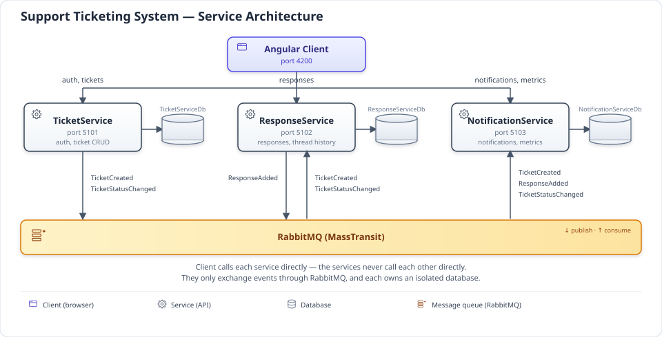

# Support Ticketing System

A customer support ticketing system built as a microservices capstone: customers raise tickets, support agents respond and manage status, and response/resolution time is tracked as a measurable business outcome.

- **ASP.NET Core Web API** (.NET 10) — three independent services, one database each
- **Angular 22** (standalone components, signals, Bootstrap 5 + ng-bootstrap) — customer and agent dashboards
- **RabbitMQ** (via MassTransit) — event-driven communication between services
- **SQL Server** — one shared instance, three isolated databases (`TicketServiceDb`, `ResponseServiceDb`, `NotificationServiceDb`)
- **Docker Compose** — the entire stack, infra and app, in one command
- **Azure Kubernetes Service + Azure DevOps** — a real trial deployment with a 5-stage CI/CD pipeline (see "Live demo" below)

## Architecture

| Service | Responsibility | Port |
|---|---|---|
| **TicketService** | Auth (JWT issuance), ticket CRUD, status/assignment | `5101` |
| **ResponseService** | Agent/customer responses on a ticket, thread history | `5102` |
| **NotificationService** | Notifications, response-time/resolution-time metrics | `5103` |
| **client** | Angular dashboard (served by nginx) | `4200` |

Services communicate only through RabbitMQ events (`TicketCreated`, `TicketStatusChanged`, `ResponseAdded`) — there are no synchronous service-to-service calls and no cross-database joins. ResponseService and NotificationService build their own local read-models purely from consumed events (event-carried state transfer).



The diagram above is app-only. For the full picture including the Azure DevOps pipeline, Key Vault, ACR, and the AKS cluster it deploys to, see the end-to-end deployment diagram:


Every service exposes `GET /health/live` (process-alive only, checked by its own Docker healthcheck) and `GET /health/ready` (SQL Server + RabbitMQ dependency check, used by Kubernetes readiness probes) — split so a transient dependency blip pulls a pod out of rotation instead of restarting it. Every service also logs structured JSON to the console enriched with a `CorrelationId` that flows from the originating HTTP request through every downstream consumer — so a single ticket's event chain is traceable across all three services' logs.

## Prerequisites

- Docker Desktop (with Compose v2)

That's it — the SDKs, Node, and Angular CLI used to build the images are baked into the Dockerfiles' build stages; you don't need them installed locally to run the stack.

## Quick start

```bash
cp .env.example .env       # fill in JWT_SECRET / RABBITMQ_USER / RABBITMQ_PASS / MSSQL_SA_PASSWORD
docker compose up --build -d
docker compose ps          # wait for everything to report healthy
```

Open **http://localhost:4200**. New accounts self-register as Customers; SupportAgent/Admin accounts come from an Admin using "Manage Users", or from the optional `INITIAL_ADMIN_*`/`LOCAL_AGENT_*` seed accounts described in the full guide below.

**Full instructions — every environment variable, logging in, using the app as each role, the browser E2E test, running on local Kubernetes, and the live AKS demo — are in [`docs/running-the-app.md`](docs/running-the-app.md).**

## Live demo

A real trial deployment on Azure Kubernetes Service, built by a 5-stage Azure DevOps pipeline (Validate → BuildAndPush → DeployDev → SmokeTest → E2ETest): **https://52.152.144.127.nip.io**. Seeded account emails and what to expect (this is a cost-constrained trial, not a production SLA) are in [`docs/running-the-app.md`](docs/running-the-app.md#track-3-azure-kubernetes-service).

## Scope notes

Deliberately left out for this capstone: no API gateway/BFF — the Angular app calls all three services through one nginx reverse proxy rather than a dedicated gateway service; no JWT refresh-token rotation — a single longer-lived access token is used instead; the AKS trial still self-hosts SQL Server and RabbitMQ in-cluster rather than managed Azure SQL/a managed broker. Full reasoning and the current list of forward-looking improvements are in [`docs/requirement/gap-analysis.md`](docs/requirement/gap-analysis.md), which also covers how this implementation compares to the original `Design Document.docx` requirements.
